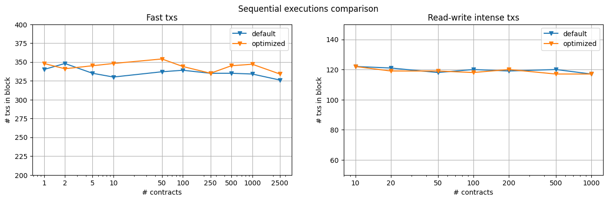

## we-benchmark

Бенчмарки и эксперименты с исполнением контрактов в сети Waves Enterprise, выполненные при исследовании параллельного исполнения транзакций в блокчейне.

Сеть разворачивалась локально с использованием `docker-compose`. Все настройки можно найти в `network/`. Из ключевого можно отметить:
* 3 ноды - 1 из них с ролью `miner`, и в некоторых экспериментах ещё 1 с ролью `contract_validator`;
* время формирования блока - 8с;
* настроена отправка метрик;
* параметр `contracts-parallelism` меняется в зависимости от эксперимента.

Для удобного взаимодействия с сетью написана небольшая библиотека на JS в `operation/` и скрипты рядом с каждым смарт-контрактом в `contracts/`.

### Эксперименты

Для docker-смарт-контрактов были получены сценарии, в которых возникает:
* [MVCC-конфликт](contracts/counter-docker/scripts/test_mvcc_conflict.js)
* [ошибка валидации](contracts/counter-docker/scripts/test_validation_error.js)  
  требует правильной настройки sleep'ов в контейнерах

### Бенчмарки

Для проведения бенчмарков JS-скрипт отправлял в сеть некоторое число транзакций, вызывающих функции docker-смарт-контракта.  
Производительность оценивалась по количеству транзакций в блоке, которое смогла включить сеть (усреднённое по блокам "принявшим на себя" нагрузку).

Для моделирования конкурентности между транзакциями, они распределялись между маленьким (высокая конкурентность) или большим (низкая конкурентность) числом идентичных смарт-контрактов.

Сравнивались варианты с параллелизмом исполнения транзакций 1,2,4,8, в разных конфигурациях:
* быстрые транзакции - инкремент 1 значения;
* транзакции, много работающие с состоянием - 9 чтений, 8 записей;
* быстрые транзакции при включённой валидации

На графиках ниже изображена засимость размера блока(производительность) от числа смарт-контрактов(конкурентность). Также, есть графики доли MVCC-конфликтов / ошибок валидации от всех исполнений контракта.

#### Быстрые транзакции

Нагрузка - 5 000 транзакций. Метод `light_increment` у Counter контракта `contracts/counter-docker/`.

#### Читающие-пишущие транзакции

Нагрузка - 2 000 транзакций. Метод `add` у CumSums контракта `contracts/cumsums-docker/`.

#### Быстрые транзакции, валидация

Нагрузка - 1 600 транзакций. Здесь транзакции отправлялись в сеть конкурентно.

#### Последовательное исполнение

Сравнение исходного и [оптимизированного](https://github.com/dmitrygulevich2000/we-node/pull/1) последовательного исполнения транзакций в первых двух сценариях.

### Оценка конкурентности

Знание фактического уровня конкурентности (contention) между транзакциями в сети нужно, чтобы предсказать эффективность работы того или иного алгоритма исполнения. Для его оценки можно рассмотреть ключи, содержащиеся в поле `results` транзакции `ExecutedContract Transaction(105)` (то есть, модифицированные в ходе исполнения).

Таким образом, я для блока можно посчитать, сколько раз в нём встретилась каждая пара (address, key) - получится некоторое распределение `key_count`. Возьмём среднее значение по парам внутри блока, назовём эту оценку `avg_key_count`. Чтобы оценка не зависела от производительности сети, времени формирования блока, "тяжести" транзакций - разделим построенное среднее на число транзакций в блоке - `norm_avg_key_count`.

Для двух сценариев бенчмарка я посчитал `avg_key_count` и `norm_avg_key_count`. Отметим, что при генерации нагрузки, в качестве задающего конкурентность параметра использовалось *число контрактов* (`#contracts`). Для `#contracts == 10` оно означает, что "каждая 10-я транзакция работала с данным ключом". Как видно на результатах ниже, оценка `norm_avg_key_count` во всех случаях совпадает с `1/#contracts`, т.е. правильно отражает ожидания от заданной нагрузки. (кроме вырожденного случая, когда никакой ключ не попадает в блок >1 раза)

